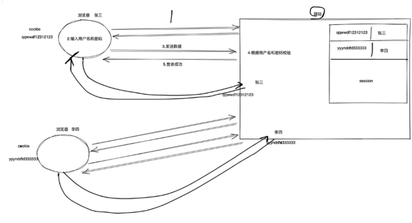
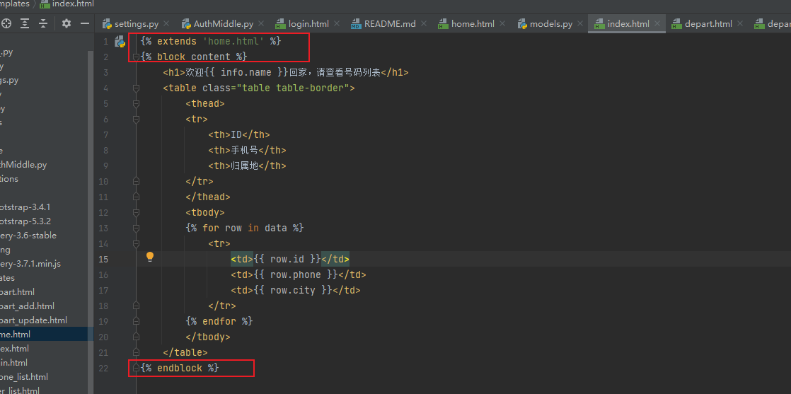
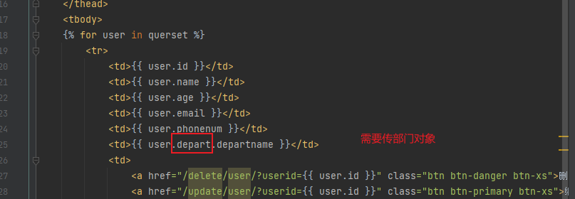
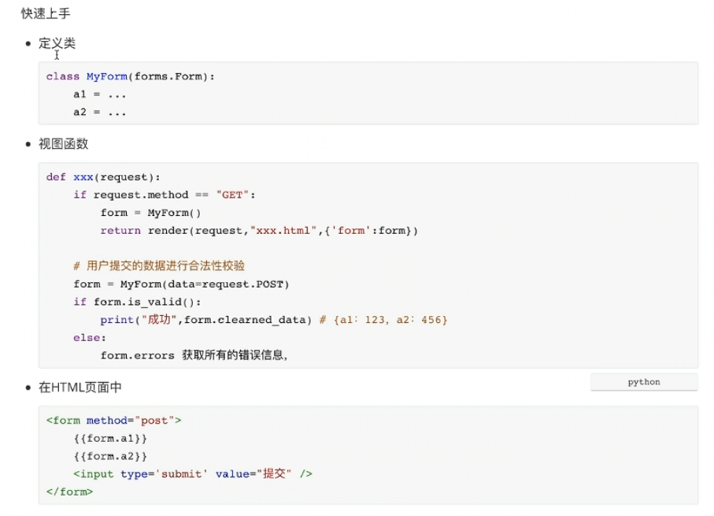
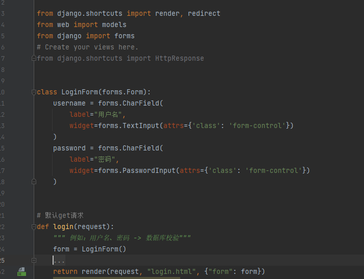
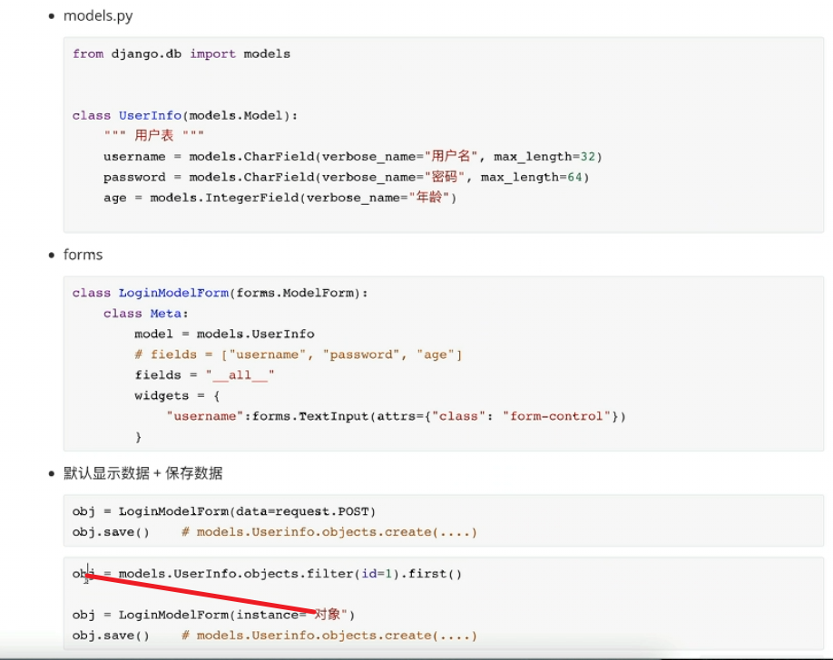
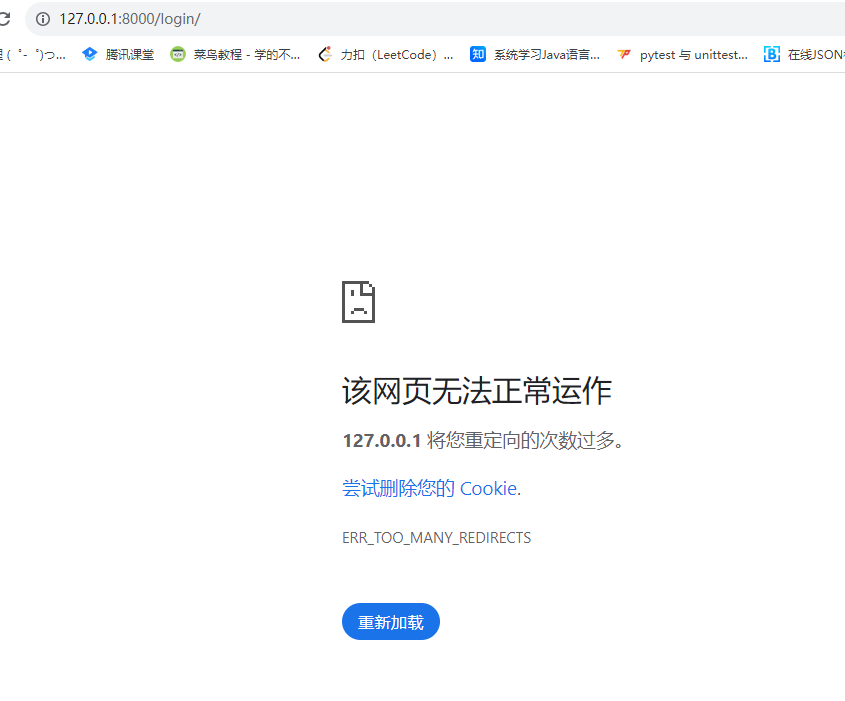

# Django+bootstrap+jqurey+mysql
## Django基础
### 虚拟环境创建
    python -m venv venv
    venv\Scripts\activate
### 1.新建django项目
    pip3 install django
    python3 -m django --version
    启动项目：
    python manage.py runserver
### 2.创建app
    python manage.py startapp xx
    补充删除app的方式：
    manage.py migrate my_app_name zero 
### 3.注册app
    settings.py中INSTALLED_APPS中 xx.app.xxConfig

### 4.配置数据库
    settings.py中DATABASES
### 5.创建表
    写models
    注册表 python manage.py makemigrations
    迁移表 python manage.py migrate
### 6.写功能代码
    urls.py配置路由
    view.py 接口进行数据操作
    templates 静态文件
### 7.静态文件配置（css、js、图片）
    static  css、js、图片

## Django进阶
### 1.Cookie和Session

### 2.中间件
    settings.py中MIDDLEWARE
    所有的请求均会经过中间件，请求数据走一遍中间件，响应数据再走一遍中间件
#### 3.自定义中间件

#### 4.模板的概念

#### 5.表连接
    # 表关联  级联删除 on_delete=models.CASCADE    级联为空 on_delete=models.SET_NULL,null=True,blank=True
    depart = models.ForeignKey(verbose_name="关联部门", to="Depart", on_delete=models.CASCADE)

#### 6.Form和ModelForm
    django中的form组件有两大作用：
        生成HTML表单标签
        数据校验

    django中ModelForm组件作用：

#### 7.Form和ModelForm的区别
    基础类别不同：Form是一个通用的表单类，用于处理与数据库模型无关的表单数据。而ModelForm是基于数据库模型的表单类，它能够直接与数据库模型进行关联，简化了表单与模型之间的交互。
    1.数据关联不同：Form处理的是独立的表单数据，而ModelForm可以与数据库模型进行关联，从而在处理表单数据时直接与模型对象进行交互，包括创建、更新和验证等操作。
    2.字段定义不同：在Form中，你需要明确地定义每个字段的类型、验证规则和显示方式等。而ModelForm会根据模型的定义自动生成相应的字段，包括字段类型、验证规则和默认值等，大大简化了表单定义的过程。
    3.数据持久化不同：Form需要手动编写代码来处理表单数据的持久化，例如保存到数据库或其他存储介质中。而ModelForm已经集成了与模型对象的交互逻辑，可以直接调用保存方法来持久化数据。
    总结来说，Form用于处理与数据库模型无关的表单数据，而ModelForm用于与数据库模型进行交互，从而简化了表单与模型之间的数据处理。如果你需要处理与数据库模型相关的表单数据，通常会选择使用ModelForm，因为它提供了更方便和高效的方式来处理模型对象的创建、更新和验证等操作。

## 问题
### 1.中间件进行鉴权过多。对于不需要鉴权的页面，中间件进行特殊处理

#   vue
    windows下npm默认路径设置
    windows下npm默认路径设置
    在你想更改的目录 D:\nodejs\ 下新建两个文件夹：node_global 和 mode_cache
    
    
    步骤一：设置路径
    
    1. 设置npm安装程序时的默认位置
    npm config set prefix "D:\nodejs\node_global"
    
    
    2. 设置npm安装程序时的缓存位置
    npm config set cache "D:\nodejs\node_cache"
    
    
    3.在系统目录中找到C:\Users\Administrator\.npmrc文件 修改如下即可：
    prefix =D:\nodejs\node_global
    cache = D:\nodejs\node_cache
    
     
    
    步骤二：设置环境变量NODE_PATH
    
    更改环境变量，计算机右击 --> 属性 --> 高级系统设置 --> 环境变量，
    系统变量里新建一条记录，变量名为NODE_PATH 值为：NODE_PATH = D:\nodejs\node_global\node_modules
    
    然后在使用npm安装程序时在后面加一个参数-g即可将安装的程序安装到我们指定的目录
    如:npm install ionic -g
    npm install XXX -g
    
    设置国内镜像
    npm config set registry https://registry.npm.taobao.org
    
    安置cnpm
    npm install -g cnpm --registry=https://registry.npm.taobao.org